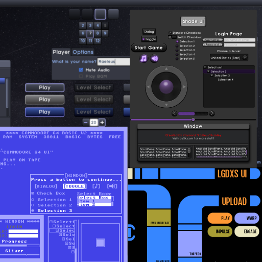

# README #

###  ###

* Use Skin Composer to create skins for libGDX's Scene2D.UI!
* Version 62
* Live preview of all widgets with configurable options
* Specify tinted, tiled, and custom created Drawables right in the editor
* Includes BitmapFont editor and Image font generator like Shoebox
* Freetype support and custom serializer to generate fonts from Json
* Nine-Patch editor with batch functions for multiple images
* Integrated support for [TenPatch](https://github.com/raeleus/TenPatch) allowing for smart-resizing, animated UI's
* Include [TinyVG](https://github.com/lyze237/gdx-TinyVG) for SVG-like vector graphics and unlimited scaling
* Implement your own classes allowing for extended Skin functionality
* Create basic Scene2D layouts with Scene Composer
* Implements a rich text editor for [TextraTypist](https://github.com/tommyettinger/textratypist) TypingLabel
* VisUI template and sample projects included
* Fork of [raeleus/skin-composer](https://github.com/raeleus/skin-composer) with the non-FLOSS Spine dependency removed

# [DOWNLOAD HERE](https://github.com/tommyettinger/Skin-Composer-Spineless/releases) #

See more examples and sample code at [Ray3k](https://ray3k.wordpress.com/artwork/ "Free Scene2D UI Skins")

### Contact ###

* This project is maintained by Tommy Ettinger and Raymond "Raeleus" Buckley
* http://ray3k.wordpress.com
* tommy.ettinger (at) gmail.com
* raymond.ray3k (at) gmail.com

### Notes ###

Skin Composer now has a wiki: [start here](https://github.com/raeleus/skin-composer/wiki) to begin learning!

If you are unable to run the Windows installer, use the JAR version with JDK version 11 or higher.

To run Skin Composer on OSX, please see the [wiki](https://github.com/raeleus/skin-composer/wiki/Getting-Started-With-Mac "Getting Started With Mac") for details.

If you are unable to open file dialogs on your platform, try version 60 or lower.
Version 62 always uses Swing file dialogs due to changes in the NFD (Native File Dialog) library that haven't yet
been addressable. Future versions may be able to use native dialogs again.

There was no version 61. It never happened. Well, it wasn't usable, anyway.

Video tutorials are available on [YouTube](https://www.youtube.com/playlist?list=PLl-_-0fPSXFfHiRAFpmLCuQup10MUJwcA).

### Contributors and Forking ###

If you have trouble compiling or running the app from source, try using JDK 21.

### License ###
MIT License

Copyright (c) 2024 Raymond Buckley
Copyright (c) 2026 Tommy Ettinger

Permission is hereby granted, free of charge, to any person obtaining a copy
of this software and associated documentation files (the "Software"), to deal
in the Software without restriction, including without limitation the rights
to use, copy, modify, merge, publish, distribute, sublicense, and/or sell
copies of the Software, and to permit persons to whom the Software is
furnished to do so, subject to the following conditions:

The above copyright notice and this permission notice shall be included in all
copies or substantial portions of the Software.

THE SOFTWARE IS PROVIDED "AS IS", WITHOUT WARRANTY OF ANY KIND, EXPRESS OR
IMPLIED, INCLUDING BUT NOT LIMITED TO THE WARRANTIES OF MERCHANTABILITY,
FITNESS FOR A PARTICULAR PURPOSE AND NONINFRINGEMENT. IN NO EVENT SHALL THE
AUTHORS OR COPYRIGHT HOLDERS BE LIABLE FOR ANY CLAIM, DAMAGES OR OTHER
LIABILITY, WHETHER IN AN ACTION OF CONTRACT, TORT OR OTHERWISE, ARISING FROM,
OUT OF OR IN CONNECTION WITH THE SOFTWARE OR THE USE OR OTHER DEALINGS IN THE
SOFTWARE.
